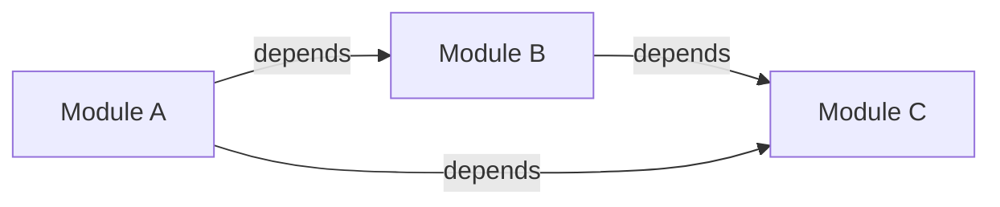

# Canonical Layout Contract

**Version:** 1.0.0  
**Status:** Enforced  
**Last Updated:** 2025-12-06

---

## Overview

All CostPilot output must use **canonical, deterministic layouts**. Same data must always produce identical formatted output, regardless of when or where it's generated.

---

## Core Principle

**Every output format has exactly ONE canonical representation.**

```
Same Data → Same Bytes
```

This contract eliminates formatting non-determinism across JSON, Markdown, Mermaid, SVG, and CLI output.

---

## JSON Canonical Layout

### Rules
```json
{
  "cost": 30.37,
  "currency": "USD",
  "interval": "month",
  "resource": {
    "id": "aws_instance.web",
    "type": "aws_instance"
  }
}
```

**Requirements:**
1. **Indent:** 2 spaces (never tabs)
2. **Line endings:** LF only (`\n`)
3. **Key order:** Alphabetical (use `BTreeMap`)
4. **Trailing:** No trailing comma
5. **Whitespace:** Single space after colon
6. **Numbers:** No `.0` for integers (`30` not `30.0`)
7. **Floats:** Max 2 decimal places for costs
8. **Arrays:** One item per line if > 3 items

### Implementation
```rust
use serde_json::{json, to_string_pretty, Value};
use std::collections::BTreeMap;

pub fn to_canonical_json<T: Serialize>(value: &T) -> Result<String> {
    // Use BTreeMap for stable key ordering
    let json_str = to_string_pretty(value)?;
    
    // Normalize line endings
    let normalized = json_str.replace("\r\n", "\n");
    
    // Ensure trailing newline
    Ok(if normalized.ends_with('\n') {
        normalized
    } else {
        format!("{}\n", normalized)
    })
}

#[test]
fn test_json_canonical_layout() {
    let mut data = BTreeMap::new();
    data.insert("resource", "aws_instance.web");
    data.insert("cost", "30.37");
    data.insert("currency", "USD");
    
    let json1 = to_canonical_json(&data).unwrap();
    let json2 = to_canonical_json(&data).unwrap();
    
    // Must be identical
    assert_eq!(json1, json2);
    
    // Must have 2-space indent
    assert!(json1.contains("  \"cost\": \"30.37\""));
    
    // Must have alphabetical keys
    let lines: Vec<&str> = json1.lines().collect();
    assert!(lines[1].contains("\"cost\""));
    assert!(lines[2].contains("\"currency\""));
    assert!(lines[3].contains("\"resource\""));
}
```

---

## Markdown Canonical Layout

### Rules
```markdown
# Cost Analysis Report

**Generated:** 2025-12-06 14:30:00 UTC

## Summary

- **Total Cost:** $30.37/month
- **Resources:** 5
- **Severity:** LOW

## Details

| Resource | Type | Cost/Month | Severity |
|----------|------|------------|----------|
| aws_instance.web | EC2 | $30.37 | LOW |
```

**Requirements:**
1. **Line width:** 80 characters max
2. **Line endings:** LF only (`\n`)
3. **Headers:** ATX-style (`#`, `##`, `###`)
4. **Lists:** Use `-` for unordered, `1.` for ordered
5. **Tables:** Aligned pipes with header separator
6. **Bold:** Use `**bold**` not `__bold__`
7. **Code:** Use triple backticks with language
8. **Trailing:** Single newline at EOF

### Implementation
```rust
use textwrap::{wrap, Options};

pub struct MarkdownBuilder {
    content: String,
    line_width: usize,
}

impl MarkdownBuilder {
    pub fn new() -> Self {
        Self {
            content: String::new(),
            line_width: 80,
        }
    }
    
    pub fn h1(&mut self, text: &str) -> &mut Self {
        self.content.push_str(&format!("# {}\n\n", text));
        self
    }
    
    pub fn h2(&mut self, text: &str) -> &mut Self {
        self.content.push_str(&format!("## {}\n\n", text));
        self
    }
    
    pub fn paragraph(&mut self, text: &str) -> &mut Self {
        let wrapped = wrap(text, self.line_width);
        for line in wrapped {
            self.content.push_str(&line);
            self.content.push('\n');
        }
        self.content.push('\n');
        self
    }
    
    pub fn list_item(&mut self, text: &str) -> &mut Self {
        self.content.push_str(&format!("- {}\n", text));
        self
    }
    
    pub fn table(&mut self, headers: &[&str], rows: &[Vec<String>]) -> &mut Self {
        // Calculate column widths
        let mut widths: Vec<usize> = headers.iter()
            .map(|h| h.len())
            .collect();
        
        for row in rows {
            for (i, cell) in row.iter().enumerate() {
                widths[i] = widths[i].max(cell.len());
            }
        }
        
        // Header row
        self.content.push('|');
        for (i, header) in headers.iter().enumerate() {
            self.content.push_str(&format!(" {:<width$} |", header, width = widths[i]));
        }
        self.content.push('\n');
        
        // Separator row
        self.content.push('|');
        for width in &widths {
            self.content.push_str(&format!("{:-<width$}|", "", width = width + 2));
        }
        self.content.push('\n');
        
        // Data rows
        for row in rows {
            self.content.push('|');
            for (i, cell) in row.iter().enumerate() {
                self.content.push_str(&format!(" {:<width$} |", cell, width = widths[i]));
            }
            self.content.push('\n');
        }
        self.content.push('\n');
        self
    }
    
    pub fn build(&self) -> String {
        // Normalize line endings
        let normalized = self.content.replace("\r\n", "\n");
        
        // Ensure single trailing newline
        if normalized.ends_with('\n') {
            normalized
        } else {
            format!("{}\n", normalized)
        }
    }
}

#[test]
fn test_markdown_line_width() {
    let mut md = MarkdownBuilder::new();
    md.paragraph("This is a very long paragraph that should be wrapped at 80 characters to ensure readability and consistent formatting across all markdown output files.");
    
    let output = md.build();
    
    for line in output.lines() {
        assert!(
            line.len() <= 80,
            "Line exceeds 80 chars: {} chars",
            line.len()
        );
    }
}
```

---

## Mermaid Canonical Layout

### Rules


**Requirements:**
1. **Direction:** `graph LR` (left-to-right)
2. **Indentation:** 4 spaces
3. **Node IDs:** Deterministic (alphabetical)
4. **Edge order:** Sorted by source, then target
5. **Labels:** Square brackets `[label]`
6. **No styling:** Colors/themes must be stable
7. **Newlines:** LF only

### Implementation
```rust
use std::collections::BTreeMap;

pub struct MermaidBuilder {
    nodes: BTreeMap<String, String>,  // id -> label
    edges: Vec<(String, String, Option<String>)>,  // (from, to, label)
}

impl MermaidBuilder {
    pub fn new() -> Self {
        Self {
            nodes: BTreeMap::new(),
            edges: Vec::new(),
        }
    }
    
    pub fn add_node(&mut self, id: &str, label: &str) {
        self.nodes.insert(id.to_string(), label.to_string());
    }
    
    pub fn add_edge(&mut self, from: &str, to: &str, label: Option<&str>) {
        self.edges.push((
            from.to_string(),
            to.to_string(),
            label.map(|s| s.to_string()),
        ));
    }
    
    pub fn build(&self) -> String {
        let mut output = String::from("graph LR\n");
        
        // Sort edges for determinism
        let mut sorted_edges = self.edges.clone();
        sorted_edges.sort_by(|a, b| {
            a.0.cmp(&b.0).then(a.1.cmp(&b.1))
        });
        
        for (from, to, label) in sorted_edges {
            let edge = if let Some(lbl) = label {
                format!("    {} -->|{}| {}\n", from, lbl, to)
            } else {
                format!("    {} --> {}\n", from, to)
            };
            output.push_str(&edge);
        }
        
        output
    }
}

#[test]
fn test_mermaid_deterministic() {
    let mut m1 = MermaidBuilder::new();
    m1.add_edge("B", "C", None);
    m1.add_edge("A", "B", None);
    m1.add_edge("A", "C", None);
    
    let mut m2 = MermaidBuilder::new();
    m2.add_edge("A", "C", None);
    m2.add_edge("A", "B", None);
    m2.add_edge("B", "C", None);
    
    // Must produce identical output despite different insertion order
    assert_eq!(m1.build(), m2.build());
}
```

---

## SVG Canonical Layout

### Rules
```xml
<svg width="800" height="600" xmlns="http://www.w3.org/2000/svg">
  <rect x="10" y="10" width="100" height="50" fill="#336699"/>
  <text x="60" y="35" text-anchor="middle" fill="#ffffff">Module A</text>
</svg>
```

**Requirements:**
1. **Dimensions:** Fixed width/height
2. **Precision:** 2 decimal places max
3. **Attributes:** Alphabetical order
4. **Colors:** Hex format (`#rrggbb`)
5. **Indent:** 2 spaces
6. **Newlines:** LF only
7. **xmlns:** Always include

### Implementation
```rust
pub struct SvgBuilder {
    width: u32,
    height: u32,
    elements: Vec<String>,
}

impl SvgBuilder {
    pub fn new(width: u32, height: u32) -> Self {
        Self {
            width,
            height,
            elements: Vec::new(),
        }
    }
    
    pub fn rect(
        &mut self,
        x: f64,
        y: f64,
        width: f64,
        height: f64,
        fill: &str,
    ) -> &mut Self {
        self.elements.push(format!(
            r#"  <rect fill="{}" height="{:.2}" width="{:.2}" x="{:.2}" y="{:.2}"/>"#,
            fill, height, width, x, y
        ));
        self
    }
    
    pub fn text(
        &mut self,
        x: f64,
        y: f64,
        content: &str,
        fill: &str,
    ) -> &mut Self {
        self.elements.push(format!(
            r#"  <text fill="{}" x="{:.2}" y="{:.2}">{}</text>"#,
            fill, x, y, content
        ));
        self
    }
    
    pub fn build(&self) -> String {
        let mut svg = format!(
            r#"<svg height="{}" width="{}" xmlns="http://www.w3.org/2000/svg">{}"#,
            self.height,
            self.width,
            "\n"
        );
        
        for element in &self.elements {
            svg.push_str(element);
            svg.push('\n');
        }
        
        svg.push_str("</svg>\n");
        svg
    }
}

#[test]
fn test_svg_canonical() {
    let mut svg = SvgBuilder::new(800, 600);
    svg.rect(10.0, 10.0, 100.0, 50.0, "#336699");
    svg.text(60.0, 35.0, "Module A", "#ffffff");
    
    let output = svg.build();
    
    // Must have alphabetical attributes
    assert!(output.contains(r#"fill="#336699" height="50.00" width="100.00" x="10.00" y="10.00""#));
    
    // Must have fixed dimensions
    assert!(output.contains(r#"height="600" width="800""#));
}
```

---

## CLI Output Layout

### Rules
```
costpilot scan terraform.plan.json

✅ Scan complete

Summary:
  Resources: 5
  Total Cost: $30.37/month
  Baseline Delta: +$5.20 (+20.6%)
  Severity: MEDIUM

Findings:
  🟡 MEDIUM: Cost increase detected
     Module: aws_instance.web
     Impact: +$5.20/month
     Confidence: 92%

Run 'costpilot explain --resource aws_instance.web' for details.
```

**Requirements:**
1. **Width:** 80 characters max
2. **Status:** Emoji + text (✅ ❌ ⚠️)
3. **Indent:** 2 spaces for nesting
4. **Alignment:** Values aligned at colon
5. **Colors:** ANSI codes (if TTY)
6. **Progress:** Overwrite line (if TTY)
7. **Newlines:** LF only

### Implementation
```rust
use colored::*;

pub struct CliOutput {
    tty: bool,
}

impl CliOutput {
    pub fn new() -> Self {
        Self {
            tty: atty::is(atty::Stream::Stdout),
        }
    }
    
    pub fn success(&self, msg: &str) {
        let prefix = if self.tty {
            "✅".green()
        } else {
            "✅".normal()
        };
        println!("{} {}", prefix, msg);
    }
    
    pub fn error(&self, msg: &str) {
        let prefix = if self.tty {
            "❌".red()
        } else {
            "❌".normal()
        };
        eprintln!("{} {}", prefix, msg);
    }
    
    pub fn warning(&self, msg: &str) {
        let prefix = if self.tty {
            "⚠️".yellow()
        } else {
            "⚠️".normal()
        };
        println!("{} {}", prefix, msg);
    }
    
    pub fn section(&self, title: &str) {
        println!("\n{}:", title);
    }
    
    pub fn field(&self, key: &str, value: &str) {
        println!("  {}: {}", key, value);
    }
    
    pub fn list_item(&self, severity: &str, msg: &str) {
        let emoji = match severity {
            "CRITICAL" => "🔴",
            "HIGH" => "🟠",
            "MEDIUM" => "🟡",
            "LOW" => "🔵",
            _ => "⚪",
        };
        println!("  {} {}: {}", emoji, severity, msg);
    }
}

#[test]
fn test_cli_output_width() {
    let cli = CliOutput::new();
    
    let long_message = "This is a very long message that should be wrapped or truncated to fit within 80 characters";
    
    // Simulate output capture
    let output = format!("{} {}", "✅", long_message);
    
    for line in output.lines() {
        assert!(
            line.len() <= 80,
            "CLI line exceeds 80 chars: {}",
            line.len()
        );
    }
}
```

---

## File Naming

### Rules
```
Canonical:
  costpilot-report-2025-12-06.json
  costpilot-analysis-YYYYMMDD-HHMMSS.md
  costpilot-graph-module-a.mermaid
  costpilot-visualization-YYYYMMDD.svg

Forbidden:
  ❌ report.json  (too generic)
  ❌ analysis_dec_6.md  (inconsistent date format)
  ❌ graph_1.mermaid  (non-deterministic numbering)
  ❌ viz.svg  (abbreviation)
```

**Pattern:**
```
{tool}-{type}-{identifier}.{ext}

tool: costpilot
type: report | analysis | graph | visualization | policy | baseline
identifier: date (YYYY-MM-DD) or module name
ext: json | md | mermaid | svg | yaml
```

### Implementation
```rust
use chrono::Utc;

pub fn generate_filename(file_type: &str, identifier: Option<&str>) -> String {
    let timestamp = Utc::now().format("%Y-%m-%d").to_string();
    
    match identifier {
        Some(id) => format!("costpilot-{}-{}.json", file_type, id),
        None => format!("costpilot-{}-{}.json", file_type, timestamp),
    }
}

#[test]
fn test_filename_canonical() {
    let filename = generate_filename("report", Some("module-a"));
    assert_eq!(filename, "costpilot-report-module-a.json");
    
    let filename = generate_filename("analysis", None);
    assert!(filename.starts_with("costpilot-analysis-"));
    assert!(filename.ends_with(".json"));
}
```

---

## Validation Tests

### JSON Layout
```rust
#[test]
fn test_json_deterministic_layout() {
    let data = sample_cost_data();
    
    let json1 = to_canonical_json(&data).unwrap();
    let json2 = to_canonical_json(&data).unwrap();
    
    assert_eq!(json1, json2, "JSON layout must be deterministic");
    
    // Check formatting rules
    assert!(json1.contains("  "));  // 2-space indent
    assert!(!json1.contains("\t"));  // no tabs
    assert!(!json1.contains("\r\n"));  // LF only
    assert!(json1.ends_with('\n'));  // trailing newline
}

#[test]
fn test_json_key_ordering() {
    let mut map = BTreeMap::new();
    map.insert("zebra", "last");
    map.insert("apple", "first");
    map.insert("banana", "second");
    
    let json = to_canonical_json(&map).unwrap();
    
    let lines: Vec<&str> = json.lines().collect();
    assert!(lines[1].contains("apple"));
    assert!(lines[2].contains("banana"));
    assert!(lines[3].contains("zebra"));
}
```

### Markdown Layout
```rust
#[test]
fn test_markdown_line_width() {
    let mut md = MarkdownBuilder::new();
    md.paragraph("A".repeat(200));
    
    let output = md.build();
    
    for line in output.lines() {
        assert!(line.len() <= 80, "Line too long: {}", line.len());
    }
}

#[test]
fn test_markdown_deterministic_tables() {
    let headers = vec!["Resource", "Cost"];
    let rows = vec![
        vec!["B".to_string(), "$20".to_string()],
        vec!["A".to_string(), "$10".to_string()],
    ];
    
    let mut md = MarkdownBuilder::new();
    md.table(&headers, &rows);
    
    let output = md.build();
    
    // Must be properly aligned
    assert!(output.contains("| Resource | Cost |"));
    assert!(output.contains("|----------|------|"));
}
```

### Mermaid Layout
```rust
#[test]
fn test_mermaid_edge_ordering() {
    let mut m = MermaidBuilder::new();
    m.add_edge("C", "A", None);
    m.add_edge("B", "A", None);
    m.add_edge("A", "D", None);
    
    let output = m.build();
    let lines: Vec<&str> = output.lines().collect();
    
    // Edges must be sorted: A->D, B->A, C->A
    assert!(lines[1].contains("A --> D"));
    assert!(lines[2].contains("B --> A"));
    assert!(lines[3].contains("C --> A"));
}
```

---

## Breaking This Contract

**Severity: MEDIUM (impacts determinism)**

**Forbidden:**
- ❌ Non-deterministic key ordering
- ❌ Variable indentation
- ❌ Mixed line endings (CRLF)
- ❌ Inconsistent formatting
- ❌ Random element ordering

**Required:**
- ✅ BTreeMap for stable keys
- ✅ Fixed indentation (2 spaces)
- ✅ LF newlines only
- ✅ Sorted elements
- ✅ Canonical whitespace

---

## Benefits

### Determinism
- Same data → identical output
- Enables snapshot testing
- Supports reproducibility
- Simplifies diffing

### Professionalism
- Consistent formatting
- Clean, readable output
- No formatting surprises
- Predictable behavior

### Testing
- Easy snapshot tests
- Simple assertions
- Reliable diffs
- No flaky tests

### Git Friendliness
- Clean diffs
- No whitespace noise
- Meaningful changes visible
- Merge conflict reduction

---

## Version History

- **1.0.0** (2025-12-06) - Initial canonical layout contract

---

**This contract ensures all CostPilot output is deterministic and consistently formatted.**
