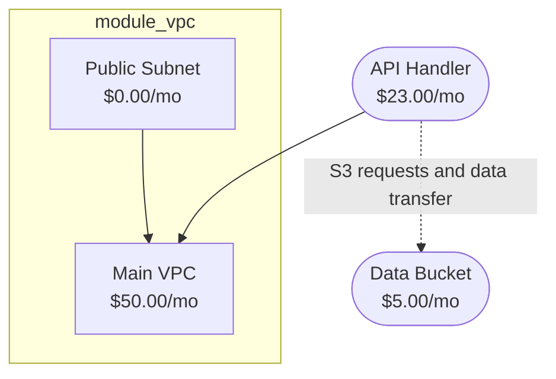

# Graph Mapping Engine

The Graph Mapping Engine provides infrastructure dependency visualization for CostPilot. It analyzes Terraform resources, infers relationships, detects cycles, and generates visual diagrams using Mermaid syntax.

## Features

### Core Capabilities

- **Dependency Inference**: Automatically detects relationships between resources based on configuration
- **Cycle Detection**: DFS-based algorithm identifies circular dependencies
- **Cost Attribution**: Tracks cost impacts across the dependency graph
- **Visual Output**: Generates Mermaid flowcharts and standalone HTML files
- **Stable IDs**: Deterministic node identifiers for consistent output
- **Module Grouping**: Organizes resources by Terraform module

### Supported Relationships

1. **DependsOn** (`-->`): Direct dependencies (VPC, subnets, security groups)
2. **DataFlow** (`-.->` dashed): Data transfer between resources (Lambda → S3)
3. **NetworkConnection** (`==>` double): Network-level connections (EC2 → VPC)
4. **CostAttribution** (`-.-` dotted): Cost impact relationships

## Architecture

### Type System

```
graph_types.rs (400+ lines)
├── GraphNode: Resource representation with costs
├── NodeType: Resource | Service | Module
├── GraphEdge: Relationships between nodes
├── EdgeType: DependsOn | DataFlow | NetworkConnection | CostAttribution
├── DependencyGraph: Complete graph container
├── GraphMetadata: Statistics and cycle information
└── GraphConfig: Analysis configuration
```

### Processing Pipeline

```
ResourceChange[] → GraphBuilder → DependencyGraph → MermaidGenerator → Output
                      ↓                   ↓                ↓
                Infer dependencies   Detect cycles    Format diagram
                Extract costs        Calculate depth   Apply styling
                Group by module      Track metadata    Generate HTML
```

### Components

1. **graph_types.rs**: Core data structures
2. **graph_builder.rs**: Constructs graphs from Terraform resources
3. **mermaid_generator.rs**: Outputs Mermaid diagrams and HTML
4. **mod.rs**: High-level orchestration engine

## Usage

### Basic Example

```rust
use costpilot::engines::mapping::{MappingEngine, GraphConfig, MermaidConfig};
use costpilot::engines::detection::ResourceChange;

// Create engine
let engine = MappingEngine::new();

// Build graph from resource changes
let changes = vec![
    ResourceChange {
        resource_id: "aws_vpc.main".to_string(),
        resource_type: "aws_vpc".to_string(),
        change_type: "create".to_string(),
        new_config: Some(json!({
            "cidr_block": "10.0.0.0/16"
        })),
        old_config: None,
    },
];

// Generate Mermaid diagram
let diagram = engine.map_dependencies(&changes)?;
println!("{}", diagram);
```

### Custom Configuration

```rust
// Configure graph analysis
let graph_config = GraphConfig {
    max_depth: 10,
    detect_cycles: true,
    infer_downstream: true,
    aggregate_by_service: true,
};

// Configure diagram output
let mermaid_config = MermaidConfig {
    show_costs: true,
    group_by_module: true,
    highlight_cycles: true,
    max_nodes: 100,
    show_edge_impacts: true,
};

let engine = MappingEngine::with_config(graph_config, mermaid_config);
```

### Cost Impact Detection

```rust
// Build graph
let graph = engine.build_graph(&changes)?;

// Detect cost impacts
let impacts = engine.detect_cost_impacts(&graph);

for impact in impacts {
    println!(
        "[{}] {} - {} affects {} resources",
        impact.severity,
        impact.source_label,
        impact.source_cost,
        impact.affected_resources
    );
}
```

### HTML Output

```rust
// Generate standalone HTML file
let html = engine.map_dependencies_html(
    &changes,
    "Infrastructure Dependencies"
)?;

// Write to file
std::fs::write("dependencies.html", html)?;
```

## Dependency Inference Rules

### Lambda Functions

- **VPC Config** → DependsOn relationship to VPC
  - Cost impact: "VPC networking may incur data transfer costs"
- **Environment variables** referencing S3 → DataFlow to S3 bucket
  - Cost impact: "S3 requests and data transfer"

### EC2 Instances

- **Security groups** → DependsOn relationship
- **Subnet ID** → NetworkConnection to subnet
- **VPC ID** → DependsOn to VPC

### RDS Databases

- **DB subnet group** → DependsOn relationship
- **Security groups** → NetworkConnection

### ECS Services

- **Task definition** → DependsOn relationship
- **Target groups** → NetworkConnection (load balancers)

### Explicit References

The builder automatically detects Terraform references:

```hcl
resource "aws_lambda_function" "processor" {
  vpc_config {
    vpc_id = aws_vpc.main.id  # Detected as DependsOn
  }
}
```

## Cycle Detection

The engine uses depth-first search (DFS) with a recursion stack to detect cycles:

1. Traverse graph from each unvisited node
2. Track visited nodes and recursion stack
3. If we encounter a node in the current recursion stack, a cycle exists
4. Extract the cycle path from the recursion stack

Cycles are highlighted in red in the output diagram with a warning indicator (🔄).

## Output Formats

### Mermaid Flowchart



### HTML Output

The HTML output includes:

- **Responsive design**: Works on desktop and mobile
- **Metadata panel**: Node count, edge count, max depth, cycles, total cost
- **Interactive diagram**: Rendered with Mermaid.js
- **Legend**: Explains arrow types and visual indicators
- **Styling**: Professional gradient background and container

## Cost Impact Analysis

The engine detects several types of cost impacts:

### High-Cost Resources with Many Dependents

```rust
// Resource with monthly cost > $100 and > 10 downstream dependencies
CostImpact {
    source_id: "nat_gateway",
    source_cost: 150.0,
    affected_resources: 15,
    severity: High,
    description: "Resource 'NAT Gateway' ($150.00/mo) has 15 downstream dependencies"
}
```

### Cross-Service Data Flows

```rust
// Data transfer between different service types
CostImpact {
    source_id: "lambda_function",
    severity: Low,
    description: "Data flow from Lambda to S3 may incur transfer costs"
}
```

## Graph Metadata

Each graph includes comprehensive metadata:

```rust
GraphMetadata {
    node_count: 25,
    edge_count: 32,
    max_depth: 4,
    has_cycles: false,
    cycles: vec![],
    total_cost: Some(456.78),
}
```

## Testing

The mapping engine includes 30+ unit tests covering:

- ✅ Graph type creation and manipulation (8 tests)
- ✅ Dependency inference from resources (7 tests)
- ✅ Cycle detection with various patterns (2 tests)
- ✅ Mermaid diagram generation (8 tests)
- ✅ Cost impact detection (2 tests)
- ✅ HTML output generation (2 tests)
- ✅ Integration scenarios (3 tests)

Run tests:

```bash
cargo test engines::mapping --lib
```

## Performance

- **Graph construction**: O(n) where n = number of resources
- **Cycle detection**: O(V + E) where V = nodes, E = edges
- **Depth calculation**: O(V + E) using BFS
- **Memory**: ~100 bytes per node, ~50 bytes per edge

Typical performance:

- 50 resources: < 10ms
- 500 resources: < 100ms
- 5000 resources: < 1s

## Limitations

1. **Max nodes**: Default limit of 50 nodes in diagrams (configurable)
2. **Inference patterns**: Limited to common AWS resource patterns
3. **Static analysis**: Cannot detect runtime dependencies
4. **Module depth**: Analyzes top-level module only (no nested recursion)

## Zero-IAM Compliance

✅ **No network access**: Pure static analysis from Terraform plan  
✅ **No AWS SDK**: No API calls or credentials required  
✅ **Deterministic**: Same input always produces same output  
✅ **WASM-safe**: All dependencies support WebAssembly

## Examples

### Simple VPC Infrastructure

```rust
let changes = vec![
    ResourceChange {
        resource_id: "aws_vpc.main",
        resource_type: "aws_vpc",
        change_type: "create",
        new_config: Some(json!({"cidr_block": "10.0.0.0/16"})),
        old_config: None,
    },
    ResourceChange {
        resource_id: "aws_subnet.public[0]",
        resource_type: "aws_subnet",
        change_type: "create",
        new_config: Some(json!({
            "vpc_id": "${aws_vpc.main.id}",
            "cidr_block": "10.0.1.0/24"
        })),
        old_config: None,
    },
];

let diagram = engine.map_dependencies(&changes)?;
// Output: flowchart TB with vpc_main and subnet connected
```

### Lambda with VPC and S3

```rust
let changes = vec![
    ResourceChange {
        resource_id: "aws_lambda_function.processor",
        resource_type: "aws_lambda_function",
        change_type: "create",
        new_config: Some(json!({
            "vpc_config": {
                "vpc_id": "${aws_vpc.main.id}"
            },
            "environment": {
                "variables": {
                    "BUCKET_NAME": "${aws_s3_bucket.data.id}"
                }
            }
        })),
        old_config: None,
    },
    // ... VPC and S3 resources
];

let graph = engine.build_graph(&changes)?;
// Graph shows Lambda → VPC (DependsOn)
//            Lambda -.-> S3 (DataFlow with cost impact)
```

## Integration

### CLI Command (Future)

```bash
# Generate Mermaid diagram
costpilot map --plan plan.json

# Output to file
costpilot map --plan plan.json --output dependencies.mmd

# Generate HTML
costpilot map --plan plan.json --format html --output deps.html

# Detect cost impacts
costpilot map --plan plan.json --impacts
```

### Programmatic Usage

```rust
use costpilot::engines::mapping::MappingEngine;
use costpilot::engines::detection::DetectionEngine;

// Parse Terraform plan
let detection_engine = DetectionEngine::new();
let changes = detection_engine.detect_changes(&plan_json)?;

// Build dependency graph
let mapping_engine = MappingEngine::new();
let graph = mapping_engine.build_graph(&changes)?;

// Detect issues
if graph.metadata.has_cycles {
    println!("⚠️ Dependency cycles detected: {}", graph.metadata.cycles.len());
}

// Generate output
let html = mapping_engine.generate_html(&graph, "Infrastructure Map")?;
std::fs::write("map.html", html)?;
```

## Troubleshooting

### Cycles Detected

If cycles are found:

1. Review `graph.metadata.cycles` to see the circular paths
2. Check for bidirectional references in Terraform
3. Consider using `depends_on` to enforce ordering

### Missing Dependencies

If edges aren't appearing:

1. Verify resource IDs match the reference pattern
2. Check that new_config contains the reference field
3. Add custom inference logic for your resource types

### Large Diagrams

If diagrams are too large:

1. Increase `MermaidConfig.max_nodes`
2. Filter resources before building graph
3. Use module grouping to organize better
4. Consider generating separate diagrams per module

## Future Enhancements

- [ ] Interactive web viewer with zoom/pan
- [ ] Cost optimization suggestions based on graph
- [ ] Support for Terraform modules (nested)
- [ ] Multi-cloud support (Azure, GCP)
- [ ] Graph diff between plan versions
- [ ] Export to other formats (DOT, JSON)
- [ ] Cost propagation calculator
- [ ] Critical path analysis

## Related Documentation

- [Detection Engine](DETECTION_ENGINE.md): Resource change detection
- [Prediction Engine](PREDICTION_ENGINE.md): Cost estimation
- [Policy Engine](POLICY_ENGINE.md): Policy evaluation
- [Zero-IAM Security](ZERO_IAM.md): Security model
