# CostPilot Mermaid Diagram Examples

## Overview

This document provides Mermaid diagram examples for visualizing CostPilot workflows, cost mappings, policy flows, and architecture.

## Workflow Diagrams

### Basic Cost Analysis Workflow


### Full CI/CD Integration

```mermaid
flowchart TD
    Start[Developer Creates PR] --> TF[Terraform Plan]
    TF --> CP[CostPilot Analyze]
    
    CP --> Parse[Parse Plan JSON]
    Parse --> Cost[Calculate Costs]
    Cost --> Baseline[Compare Baseline]
    Baseline --> Policy[Evaluate Policies]
    Policy --> Drift[Detect Drift]
    Drift --> Predict[AI Predictions]
    
    Predict --> Report[Generate Report]
    Report --> Comment[Post PR Comment]
    
    Comment --> Check{Pass All Checks?}
    Check -->|Yes| Approve[✓ Approve Merge]
    Check -->|Policy Violation| Review[⚠ Require Approval]
    Check -->|Critical Drift| Block[❌ Block Merge]
    
    Review --> Manual[Manual Review]
    Manual --> Decision{Exemption Granted?}
    Decision -->|Yes| Approve
    Decision -->|No| Block
    
    Block --> Fix[Developer Fixes]
    Fix --> Start
```



### Policy Evaluation Flow


## Cost Mapping Diagrams

### Resource to Cost Mapping


### Module Cost Breakdown


### Cost Trend Over Time


## Architecture Diagrams

### CostPilot System Architecture


### Drift Detection Flow

```mermaid sequenceDiagram
    participant TF as Terraform
    participant CP as CostPilot
    participant Baseline as Baseline Store
    participant Checksum as SHA256 Engine
    
    TF->>CP: Submit plan.json
    CP->>Checksum: Calculate current checksum
    Checksum-->>CP: SHA256 hash
    
    CP->>Baseline: Fetch expected checksum
    Baseline-->>CP: Previous SHA256 hash
    
    CP->>CP: Compare checksums
    
    alt Checksums Match
        CP-->>TF: ✓ No drift detected
    else Checksums Differ
        CP->>CP: Identify drifted attributes
        CP->>CP: Assess criticality
        
        alt Critical Drift
            CP-->>TF: ❌ Block execution
        else Non-Critical Drift
            CP-->>TF: ⚠ Warning issued
        end
    end
```

### Policy Enforcement Sequence

```mermaid sequenceDiagram
    participant Dev as Developer
    participant PR as Pull Request
    participant CI as CI/CD
    participant CP as CostPilot
    participant Policy as Policy Engine
    participant Approver as Tech Lead
    
    Dev->>PR: Create PR with changes
    PR->>CI: Trigger workflow
    CI->>CP: Run cost analysis
    
    CP->>Policy: Load policies
    Policy->>Policy: Evaluate rules
    
    alt No Violations
        Policy-->>CP: ✓ Pass
        CP-->>CI: Approve
        CI-->>PR: ✓ Checks pass
        PR-->>Dev: Can merge
    else Warning Level
        Policy-->>CP: ⚠ Warnings
        CP-->>CI: Pass with warnings
        CI-->>PR: ⚠ Review recommended
        PR-->>Dev: Can merge with caution
    else Requires Approval
        Policy-->>CP: 🔔 Approval needed
        CP-->>CI: Request approval
        CI-->>PR: 🔔 Awaiting approval
        PR-->>Approver: Notify for review
        Approver->>PR: Review and approve
        PR-->>Dev: Can merge after approval
    else Blocking Violation
        Policy-->>CP: ❌ Block
        CP-->>CI: Fail check
        CI-->>PR: ❌ Checks failed
        PR-->>Dev: Cannot merge - fix required
    end
```

## Data Flow Diagrams

### Cost Calculation Pipeline


### Baseline Update Process

```mermaid
stateDiagram-v2
    [*] --> LoadBaseline
    LoadBaseline --> AnalyzeCurrent
    AnalyzeCurrent --> CompareCosts
    
    CompareCosts --> NoChange: Costs unchanged
    CompareCosts --> MinorChange: <10% change
    CompareCosts --> MajorChange: ≥10% change
    
    NoChange --> [*]
    MinorChange --> AutoUpdate: Auto-update enabled
    MinorChange --> ManualReview: Auto-update disabled
    MajorChange --> ManualReview
    
    AutoUpdate --> SaveBaseline
    ManualReview --> ApprovalRequired
    ApprovalRequired --> Approved: Approved
    ApprovalRequired --> Rejected: Rejected
    
    Approved --> SaveBaseline
    Rejected --> [*]
    SaveBaseline --> [*]
```



## Use Case Scenarios

### Scenario 1: Cost Regression Detected


### Scenario 2: Policy Violation


### Scenario 3: Drift Detection


## Integration Diagrams

### GitHub Actions Integration

```mermaid
graph TD
    Event[PR Event] --> Trigger[Trigger Workflow]
    Trigger --> Checkout[Checkout Code]
    Checkout --> TFSetup[Setup Terraform]
    TFSetup --> TFInit[Terraform Init]
    TFInit --> TFPlan[Terraform Plan]
    TFPlan --> TFShow[Convert to JSON]
    
    TFShow --> CPAction[CostPilot Action]
    CPAction --> Analysis[Run Analysis]
    
    Analysis --> Estimate[Cost Estimation]
    Analysis --> Policy[Policy Check]
    Analysis --> Drift[Drift Detection]
    Analysis --> Predict[AI Prediction]
    
    Estimate --> Report[Generate Report]
    Policy --> Report
    Drift --> Report
    Predict --> Report
    
    Report --> Comment[Post PR Comment]
    Report --> Status{Check Status}
    
    Status -->|Pass| Success[✓ Success]
    Status -->|Warning| Neutral[⚠ Neutral]
    Status -->|Fail| Failure[❌ Failure]
    
    Success --> Artifact[Upload Artifacts]
    Neutral --> Artifact
    Failure --> Artifact
```



### Multi-Environment Workflow


## Visualization Examples

### Cost Impact Heatmap


### Decision Tree for Policy Actions

```mermaid
graph TD
    Start[Policy Evaluation] --> CostCheck{Cost Increase?}
    
    CostCheck -->|<10%| Low[Low Impact]
    CostCheck -->|10-30%| Med[Medium Impact]
    CostCheck -->|>30%| High[High Impact]
    
    Low --> AutoApprove[✓ Auto-Approve]
    
    Med --> PolicyCheck{Policy Violation?}
    PolicyCheck -->|No| AutoApprove
    PolicyCheck -->|Yes| Warn[⚠ Warning]
    
    High --> RequireApproval[🔔 Require Approval]
    
    RequireApproval --> Review[Manual Review]
    Review --> Decision{Approved?}
    Decision -->|Yes| Exemption[Grant Exemption]
    Decision -->|No| Block[❌ Block]
    
    Exemption --> TimeLimit{Time-Bound?}
    TimeLimit -->|Yes| SetExpiry[Set Expiration]
    TimeLimit -->|No| Permanent[Permanent Exemption]
    
    SetExpiry --> Approve[✓ Approve]
    Permanent --> Approve
```



## Summary

These Mermaid diagrams can be embedded in documentation, pull requests, and dashboards to visualize:

- **Workflows**: How CostPilot integrates into CI/CD
- **Cost Mappings**: How resources map to costs
- **Policy Flows**: How policies are evaluated and enforced
- **Architecture**: System components and interactions
- **User Journeys**: Developer/SRE experience

### Usage in Markdown

```markdown
# Example: Embedding in Documentation

## Cost Analysis Workflow

\`\`\`mermaid
flowchart LR
    A[Terraform Plan] --> B[CostPilot]
    B --> C[Report]
\`\`\`
```

### Rendering

- **GitHub**: Renders Mermaid natively in READMEs and PRs
- **GitLab**: Supports Mermaid in markdown
- **VS Code**: Use Mermaid Preview extension
- **Documentation Sites**: MkDocs, Docusaurus support Mermaid

---

**Last Updated:** December 2025
**Version:** 1.0.0
